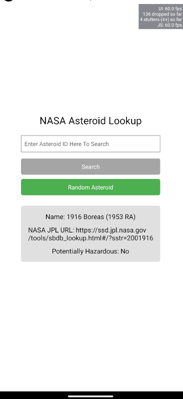
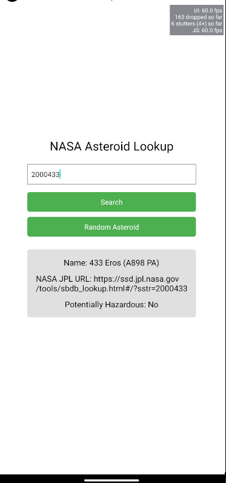

# NASA Asteroid Lookup App

This is a simple React Native Expo app that allows users to look up information about asteroids using NASA's Near-Earth Object (NEO) API. Users can search for specific asteroids by their ID or retrieve information on a random asteroid.

## Features

- **Asteroid Search**: Users can enter an asteroid ID to look up its details.
- **Random Asteroid**: Users can retrieve information on a randomly selected asteroid.
- **Data Display**: For each asteroid, the app shows:
    - Name
    - NASA JPL URL
    - Whether it's potentially hazardous or not

## Screenshots

### Random Asteroid


### Search asteroid via asteroid ID


## Installation

1. Clone this repository:

   ```bash
   git clone https://github.com/yourusername/nasa-asteroid-lookup.git
   cd nasa-asteroid-lookup
   ```

2. Create a `.env` file in the root directory by copying `.env.example` and add your NASA API key:

   ```plaintext
   NASA_API_KEY=your_api_key_here
   ```
3. Start the Expo development server:

   ```bash
   npx expo start
   ```

## Usage

1. **Search by Asteroid ID**:
    - Enter an asteroid ID in the input field.
    - Press **Search** to retrieve information on that specific asteroid.

2. **Random Asteroid**:
    - Press **Random Asteroid** to fetch information about a random asteroid.

## Dependencies

- [React Native](https://reactnative.dev/)
- [Expo](https://expo.dev/)
- [Axios](https://github.com/axios/axios)
- [dotenv](https://github.com/motdotla/dotenv)

